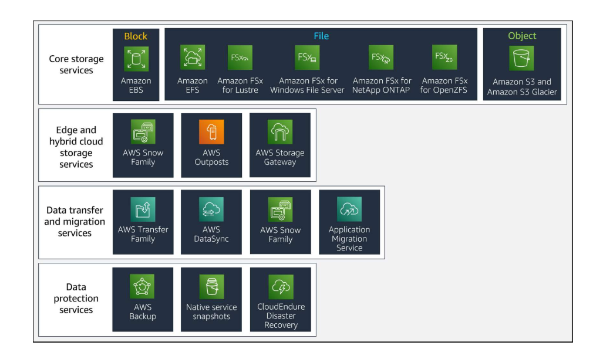

# AWS Storage.

## Core AWS Storage Services.

+ Increase organization agility.
+ Storage agility in AWS.
+ Accelerate ability to innovate.
+ Strengthen security.
+ Reduce cost.
+ operational expense versus capital investment.
+ You pay for you used space, not pay for availabilty space.
+ Raw capacity.
+ Formatted capacity.
+ Allocated capacity.
+ Actual data capacity.
+ Capacity overhead in AWS cloud.
+ Block storage.
+ File storage is build on top of block storage.
+ Object storage is build on top of block storage.

## Introduction to the AWS Storage Portfolio.

+ AWS core storage services.
    + Block storage.
        + For requirement low latency application , is analogous to DAS or SAN.
    + File storage.
        + Is analogous to NAS, some applications need access to the files.
    + Object storage.

### Edge and hybrid cloud storage services

+ AWS snow family.
+ AWS outpost.
+ AWS storage gateway.

### Data transfer and migration services.

+ AWS Transfer family.
+ AWS DataSync.
+ AWS Snow Family.
+ Application Migration Services.

### Data protection services.

+ Backup and archive.
+ Snapshots.
+ Replication.
+ Disaster recovery services.

### Disaster protection services.

+ AWS Backup.
+ AWS Native services endpoints.
+ CloudEndure Disaster Recovery.

## Identifying the right storage solution in the cloud.

### Storage characteristics and requirements

### Questions to help determine storage requirements

### Evaluate available configuration options

+ Provisioned IOPS.
+ Solid state drives ( SSD )
+ Hard disk drivers ( HDD )
+ Object storage.
+ Archival storage.
+ Ephemeral ( temporary ) storage.

### Determine storage characteristics.

+ Ability to share the storage.
+ Ideal file size and maximum file size.
+ Storage cache size.
+ Average or expected latency.
+ Maxinum throughput.
+ Maximum IOPS.
+ Persistence of data.

### Make decisions based on access patterns and metrics 

+ Optimize your storage usage and access patterns.
+ Select appropriate metrics for storage options.
+ Monitor metrics.
